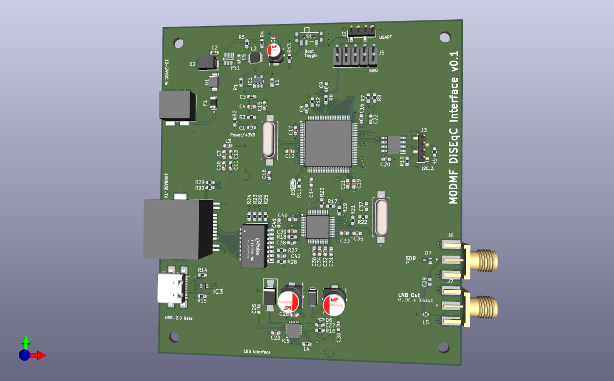
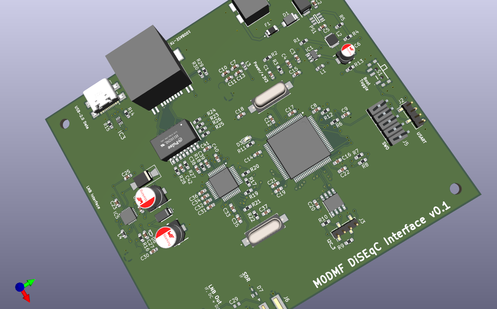
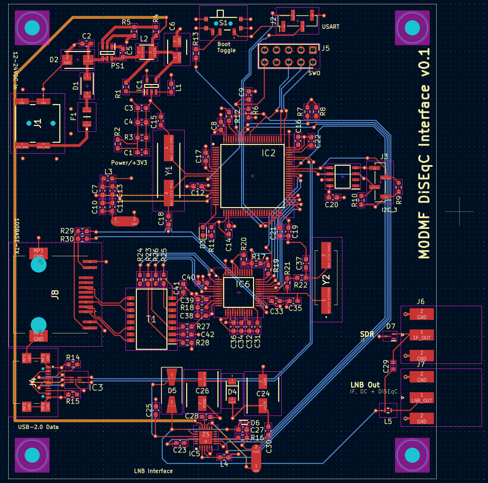

# diseqc_cntrl

Ethernet-connected DiSEqC motor control interface for satellite LNB systems, built around an STM32F407 microcontroller.

## Disclaimer

This project is in development. No hardware or software testing has been performed and use in any way is at your own risk.

## Introduction

Enables remote control of LNB power supply voltage (13 V / 18 V polarization selection), DiSEqC 1.x command generation, and IF signal routing — all manageable over a 10/100 Mbps Ethernet link or USB.

## PCB

4-layer board (F.Cu / In1.Cu / In2.Cu / B.Cu) with split ground planes — digital GND, analog GNDA, and power PGND domains are connected via net ties at controlled star-ground points to minimise noise coupling into the LNB signal path.

## Hardware Overview

### Microcontroller

- **STM32F407VGT6** (ARM Cortex-M4, 168 MHz, 1 MB Flash, 192 KB RAM, LQFP-100)
- 8 MHz HSE crystal (ABLS-8.000MHZ-20-B-3-H-T) on PH0/PH1 with C15/C18 load capacitors
- Separate filtered +3V3_ANA rail for the on-chip ADC reference
- Status LED (green, 0603)

### Key peripherals used

| Peripheral | Function |
| --- | --- |
| I2C1 | LNBH26PQR LNB supply controller |
| I2C3 | FM24CL16B 16 Kb F-RAM and expansion header |
| SPI | W5500 Ethernet controller |
| TIM4 CH1 | DiSEqC 22 kHz tone generation |
| USART3 | Serial debug / expansion (pin header J2) |
| USB OTG FS | USB 2.0 device (USB-C) |
| SWD | Debug port (2×5 pin header J5) |

### Power Supply

**Input:** Barrel jack (RASM742TRX, 2.1 mm centre-positive)

Protection chain (in order):

1. **F1** — PTC resettable fuse (1812L075/33DR, 0.75 A hold / 33 V)
2. **D2** — SMBJ24D bidirectional TVS (24 V clamp)
3. **D1** — SS14F-HF Schottky diode (reverse polarity protection)

Regulation:

| Stage | Device | Topology | Output |
| --- | --- | --- | --- |
| 1 | PS1 (TPS560430XDBVR) | Synchronous buck (4.3–36 V in) | +12 V (feeds LNBH26PQR) |
| 2 | TPS560200DBVR | Buck (4.5–17 V in) | +3.3 V (digital logic) |

A filtered +3V3_ANA rail is derived from +3.3 V via a ferrite bead for the MCU analog supply.

### LNB Control — LNBH26PQR

- Dual LNB supply regulator with integrated step-up converter (ST LNBH26PQR, QFN-24)
- Powered from the +12 V rail
- Generates switchable 13 V / 18 V output for LNB polarization selection
- Built-in DiSEqC 1.x/2.x 22 kHz tone modulation, driven from TIM4 CH1
- Fault output routed to MCU GPIO
- External boost components: STPS130A Schottky, US1A rectifier, 33 µH inductor, 100 µF bulk caps
- DiSEqC envelope detection via BAT43XV2 small-signal Schottky
- ESD protection on coaxial outputs (RCLAMP0502BATCT)

### Ethernet

- **W5500** hardwired TCP/IP controller (WIZnet, QFP-48) on SPI bus
- 25 MHz crystal (ABLS-25.000MHZ-D-FT)
- **H1102NL** 1:1 Ethernet isolation transformer (Pulse Electronics)
- **RJCSE-538101** RJ45 connector with integrated link/activity LEDs (Amphenol)

### USB

- **USB4110-GF-A** USB Type-C receptacle (USB 2.0)
- **USBLC6-2P6** ESD protection on D+/D−
- Connected to STM32 USB OTG FS peripheral

### Non-Volatile Storage

- **FM24CL16B-GTR** 16 Kb F-RAM (Infineon, I2C, SOIC-8)
- Unlimited write endurance — stores network configuration, LNB settings, and DiSEqC sequence parameters

### Connectors

| Ref | Type | Purpose |
| --- | --- | --- |
| J1 | Barrel jack (RASM742TRX) | DC power input |
| J2 | 1×4 pin header (2.00 mm) | USART3 serial header (+3V3, TX, RX, GND) |
| J3 | 1×4 pin header (2.00 mm) | I2C3 expansion header (+3V3, SCL, SDA, GND) |
| J4 | USB-C (USB4110-GF-A) | USB 2.0 device |
| J5 | 2×5 pin header (2.54 mm) | SWD debug |
| J6 | SMA edge-mount | IF input from LNB |
| J7 | SMA edge-mount | LNB output (power + DiSEqC + IF) |
| J8 | RJ45 (RJCSE-538101) | 10/100 Ethernet |
| S1 | SPDT slide switch (PCM12SMTBR) | Mode / power select |

### Test Points

| Ref | Net | Purpose |
| --- | --- | --- |
| TP1 | VIN_FUSED | Input rail after PTC fuse |
| TP2 | +12V | Main regulated 12 V rail |
| TP3 | +3V3 | Main digital logic rail |
| TP4 | VIN_RAW | Input rail before fuse/protection chain |
| TP5 | VIN_PROTECTED | Input rail after TVS and reverse-polarity diode |
| TP6 | +3V3_ANA | Filtered analog 3.3 V rail |
| TP7 | VSSA | Analog ground reference |
| TP8 | /MCU/BOOT0 | MCU BOOT0 strap node |
| TP9 | VBUS | USB VBUS (5 V) |
| TP10 | /MCU/CC1 | USB-C CC1 configuration channel |
| TP11 | /MCU/CC2 | USB-C CC2 configuration channel |
| TP12 | IF_OUT | IF signal path node |
| TP13 | LNB_OUT | LNB output node |
| TP14 | /MCU/LNBH26PQR/LNB_FLT | LNB controller fault signal |

### Protection

| Component | Type | Location |
| --- | --- | --- |
| F1 (1812L075/33DR) | PTC fuse, 0.75 A / 33 V | Power input |
| D2 (SMBJ24D) | 24 V bidirectional TVS | After fuse |
| D1 (SS14F-HF) | Schottky reverse polarity | After TVS |
| IC3 (USBLC6-2P6) | USB ESD clamp | USB D+/D− |
| D7 (RCLAMP0502BATCT) | ESD / CDE clamp | LNB coaxial I/O |

## Design Notes

- 4-layer PCB with split ground planes joined at star-ground net ties
- Predominantly 0603 passives throughout
- 3D models (STEP) provided for all major components
- Gerbers exported to `fab/gerber/`
- All Mouser part numbers embedded in schematic symbols for direct BOM procurement
- Crystal load-capacitor values are documented on schematic and periodically re-validated against crystal load specs and board parasitics
