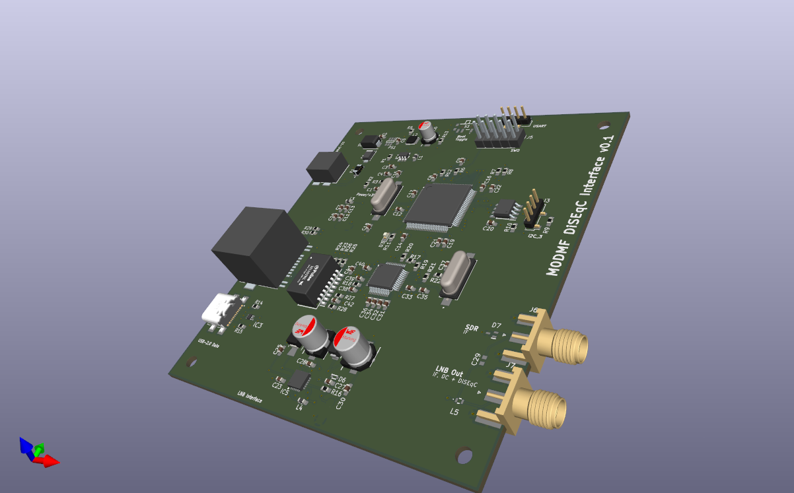
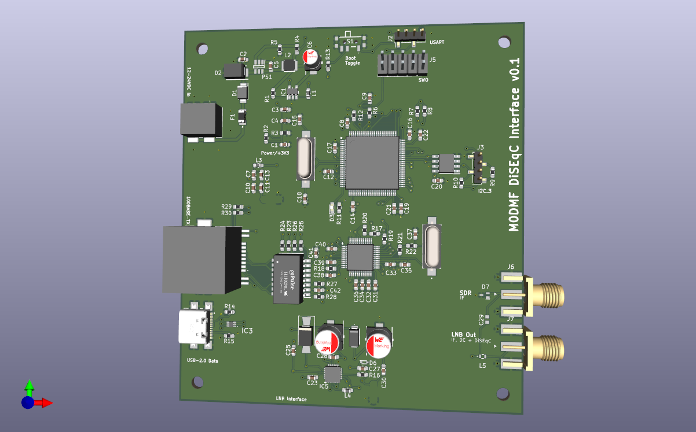
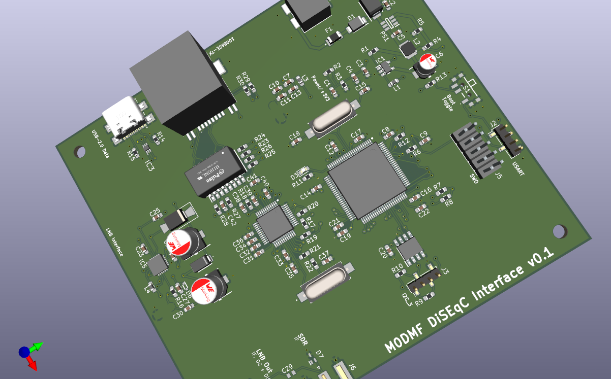
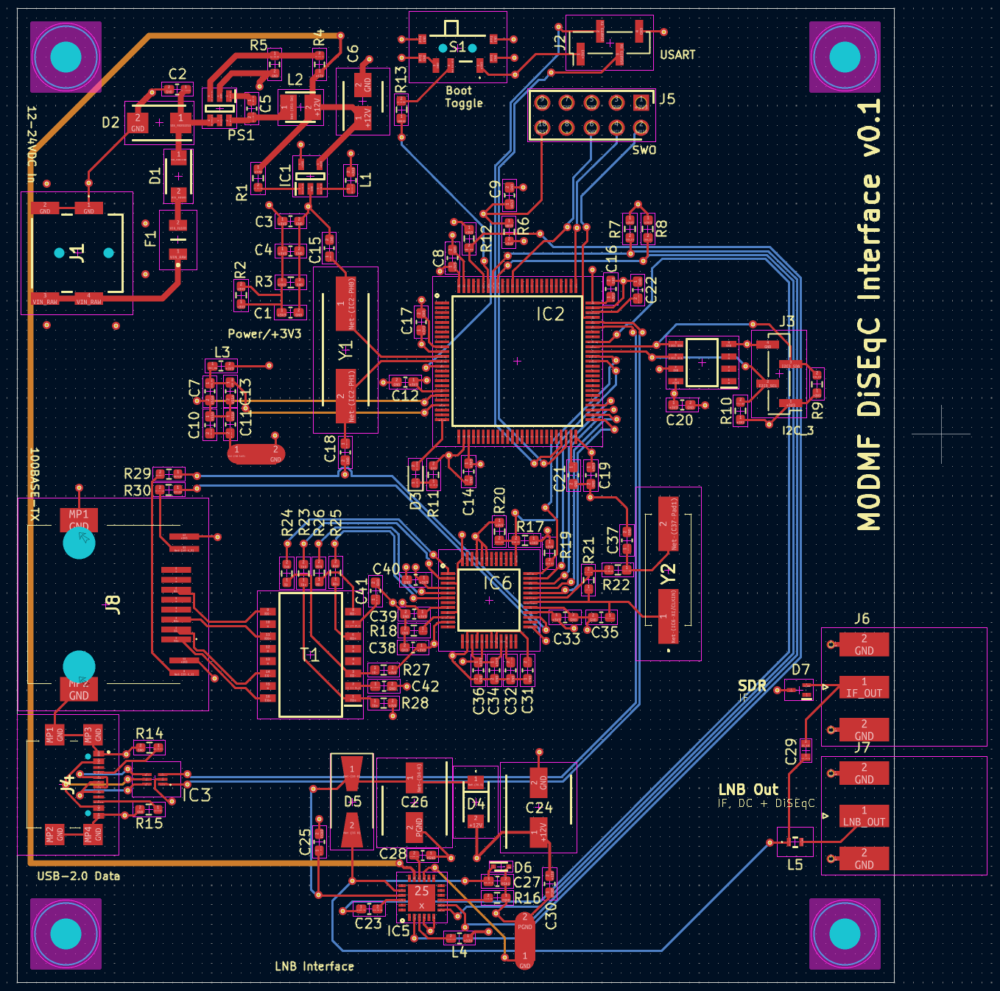

# diseqc_cntrl

Ethernet-connected DiSEqC motor control interface for satellite LNB systems, built around an STM32F407 microcontroller and LAN8742A Ethernet PHY.

## Disclaimer

This project is in development. Hardware bring-up is ongoing and the current PCB has not completed release validation. Use in any way is at your own risk.

## Introduction

Enables remote control of LNB power supply voltage (13 V / 18 V polarization selection), DiSEqC 1.x command generation, and IF signal routing — all manageable over a 10/100 Mbps Ethernet link or USB.

## Repository Structure

The project is intentionally split into separate domains:

1. `hardware/`  
	KiCad schematics, PCB layout, fabrication outputs, and hardware-specific assets.
2. `software/nanoFramework/`  
	Managed application + native integration layer used by this project.
3. `nf-interpreter` (external dependency at build time)  
	The nanoFramework/ChibiOS firmware base is cloned during build and patched with this repository's target files.

See:
- `hardware/README.md`
- `software/README.md`
- `software/nanoFramework/README.md`

## PCB

90 mm × 100 mm, 1.6 mm, 4-layer board (F.Cu / In1.Cu / In2.Cu / B.Cu). In1 is a near-solid GND reference plane and In2 carries power distribution. Filtered analog and Ethernet supply domains join the main rails through net ties and ferrite beads.

## Hardware Overview

### Microcontroller

- **STM32F407VGT6** (ARM Cortex-M4, 168 MHz, 1 MB Flash, 192 KB RAM, LQFP-100)
- 8 MHz HSE crystal (ABLS-8.000MHZ-20-B-3-H-T) on PH0/PH1 with C15/C18 load capacitors
- Separate filtered +3V3_ANA rail for the on-chip ADC reference
- Status LED (green, 0603)

### Key peripherals used

| Peripheral | Function |
| --- | --- |
| I2C1 | LNBH26PQR LNB supply controller |
| I2C3 | FM24CL16B 16 Kbit F-RAM |
| RMII | LAN8742A 10/100 Ethernet PHY |
| TIM4 CH1 | DiSEqC 22 kHz tone generation |
| USART3 | FT230XS USB-to-UART and debug header |
| USB OTG FS | Native USB 2.0 device (USB-C) |
| SWD | Debug port (2×5 pin header J5) |

### Power Supply

**Input:** Barrel jack (RASM742TRX, 2.1 mm centre-positive)

Protection chain (in order):

1. **F1** — PTC resettable fuse (1812L075/33DR, 0.75 A hold / 33 V)
2. **D2** — SMBJ24D bidirectional TVS (24 V clamp)
3. **D1** — SS14F-HF Schottky diode (reverse polarity protection)

Regulation:

| Stage | Device | Topology | Output |
| --- | --- | --- | --- |
| 1 | IC1 (LMR36520ADDAR) | 400 kHz synchronous buck | +12 V (feeds LNBH26PQR) |
| 2 | IC2 (LMR36520ADDAR) | 400 kHz synchronous buck | +3.3 V (digital logic) |

Filtered +3.3VA and Ethernet 3V3_BEADED rails are derived from +3V3 through net ties and ferrite beads.

### LNB Control — LNBH26PQR

- LNB supply regulator with integrated step-up converter (ST LNBH26PQR, QFN-25)
- Powered from the +12 V rail
- Generates switchable 13 V / 18 V output for LNB polarization selection
- Built-in DiSEqC 1.x/2.x 22 kHz tone modulation, driven from TIM4 CH1
- Fault output routed to MCU GPIO
- External boost components: STPS130A Schottky, US1A rectifier, 33 µH inductor, 100 µF bulk caps
- DiSEqC envelope detection via BAT43XV2 small-signal Schottky
- Low-capacitance ESD protection on the IF output (RClamp0502BA connection using RCLAMP0502BATCT)

### Ethernet

- **LAN8742A-CZ-TR** 10/100 Ethernet PHY connected to the STM32 by RMII
- 50 MHz RMII reference clock and 33 Ω source-series resistors on clock/data/control signals
- 25 MHz crystal (ABLS-25.000MHZ-D-FT)
- **J0011D21BNL** RJ45 connector with integrated 1:1 magnetics and LEDs

### USB

- Two **USB4110-GF-A** USB Type-C receptacles
- Native STM32 USB OTG FS port with **USBLC6-2P6** data-line ESD protection
- Separate **FT230XS** USB-to-USART3 debug port

### Non-Volatile Storage

- **FM24CL16B-GTR** 16 Kb F-RAM (Infineon, I2C, SOIC-8)
- High-endurance storage for network configuration, LNB settings, and DiSEqC sequence parameters

### Connectors

| Ref | Type | Purpose |
| --- | --- | --- |
| J1 | Barrel jack (RASM742TRX) | DC power input |
| J2 | 1×4 pin header | USART3 serial debug |
| J3 | USB-C (USB4110-GF-A) | Native STM32 USB 2.0 device |
| J4 | 1×4 pin header | I2C expansion |
| J5 | 2×5 pin header (2.54 mm) | SWD debug |
| J6 | USB-C (USB4110-GF-A) | FT230XS USB-to-UART debug |
| J7 | SMA edge-mount | IF output |
| J8 | SMA edge-mount | LNB output (power + DiSEqC + IF) |
| J9 | RJ45 (J0011D21BNL) | 10/100 Ethernet with integrated magnetics |
| SW1 | Momentary push button | MCU reset |

### Test and Debug Access

- 12 named test points cover the raw, fused, and protected input rails; +12V; +3V3; VBUS; reset/boot; LNB fault/DiSEqC; and both LNB I2C lines.
- SWD/SWO is exposed at J5 and USART3 is exposed at J2 and through the FT230XS port.
- High-speed RMII, Ethernet MDI, USB, and IF signals intentionally have no branch test points in the current layout.

### Protection

| Component | Type | Location |
| --- | --- | --- |
| F1 (1812L075/33DR) | PTC fuse, 0.75 A / 33 V | Power input |
| D2 (SMBJ24D) | 24 V bidirectional TVS | After fuse |
| D1 (SS14F-HF) | Schottky reverse polarity | After TVS |
| IC5 (USBLC6-2P6) | USB ESD clamp | Native USB D+/D− |
| D6 (RCLAMP0502BATCT) | Low-capacitance ESD clamp | IF output |

## Design Notes

- 4-layer PCB with a near-solid In1 GND plane and In2 power distribution
- Predominantly 0603 passives throughout
- 3D models (STEP) provided for all major components
- Production outputs are under `hardware/kicad-project/production/` and must be regenerated after design changes
- The current design review is `hardware/kicad-project/DESIGN_REVIEW_2026-08-13-rev2.md`; its release blockers must be closed before fabrication
- Crystal load-capacitor values are documented on schematic and periodically re-validated against crystal load specs and board parasitics
